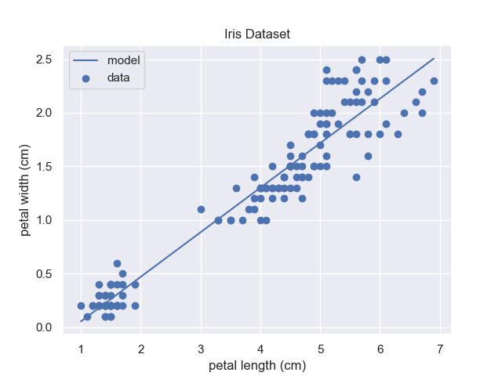

# Serving ML Models with Flask

_created by Austin Poor_

This repo is a demo of serving a `scikit-learn` model as an API using `Flask`. For the purposes of this example the model uses the iris dataset to predict `petal-width` using `petal-length`.

## Scripts



The script [`make-model.py`](make-model.py) builds the model and model and pickles it.

The script [`serve-model.py`](serve-model.py) uses `Flask` to serve the trained model as an API (in debug mode). 

```bash
$ python serve-model.py
```

Otherwise, it can be run with a WSGI server like Gunicorn.

```bash
$ gunicorn serve-model:app
```

## Testing the API

There's a supplied [`Dockerfile`](./Dockerfile) for testing the model API.

**1) Build the container**
```bash
docker build -t py-model-api .
```

**2) Run the container**
```bash
docker run --name my_model_api --rm -p 8000:8000 py-model-api
```

**3) Query the API**

```bash
curl "http://localhost:8000/iris?input=\[1,3,5,7\]"
```

## Using the API

### GET `/iris?input=<data>`

The endpoint for the model is `/iris` and it takes one argument called `input` which is either a single number of an array of numbers to make predictions.

The API would repond to the request `/iris?input=[1]` with a response similar to the following:

```json
{
    "prediction":[
        0.05267989503338244
    ],
    "type": "success"
}
```

### Possible Error Responses

**Error type:** No arguments provided

```json
{
    "message": "No data provided",
    "type": "error"
}
```

**Error type:** No `input` Argument

```json
{
    "message": "No input data provided",
    "type": "error"
}
```

**Error type:** Bad input data

```json
{
    "message": "Error formatting input",
    "type": "error"
}
```

**Error type:** Model prediction error

```json
{
    "message": "Error making prediction",
    "type": "error"
}
```


